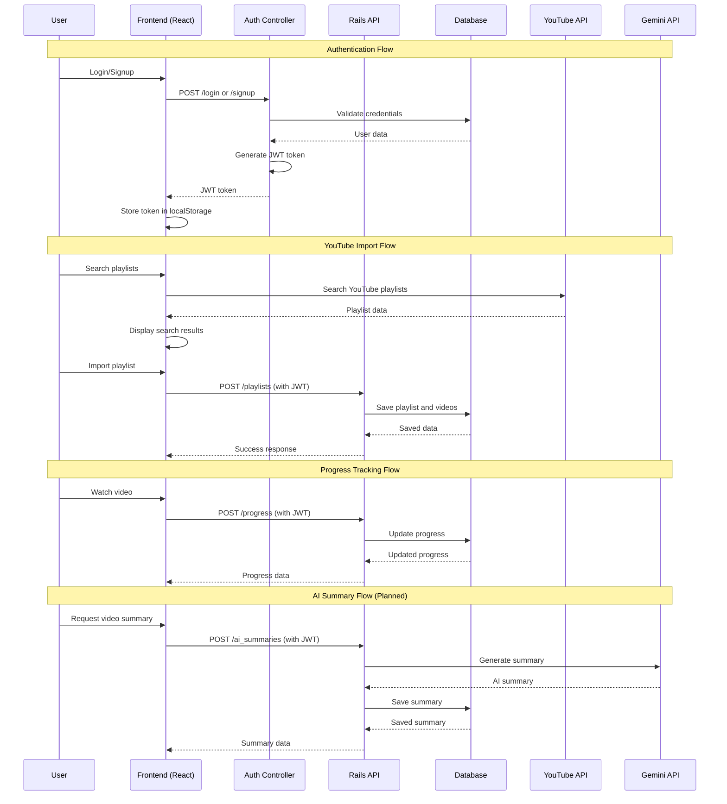

# YouTube Learning Manager - System Architecture

## High-Level Architecture Overview

```mermaid
graph TB
    subgraph "Client Layer"
        Browser[Web Browser]
        React[React Frontend<br/>TypeScript + Vite]
    end
    
    subgraph "API Gateway & Authentication"
        CORS[CORS Middleware]
        JWT[JWT Authentication]
        AuthController[Auth Controller]
    end
    
    subgraph "Backend Services"
        Rails[Rails API Server<br/>Ruby 3.4.2]
        Controllers[API Controllers]
        Models[ActiveRecord Models]
        Serializers[JSON:API Serializers]
    end
    
    subgraph "Data Layer"
        PostgreSQL[(PostgreSQL Database)]
        Cache[Solid Cache]
        Queue[Solid Queue]
    end
    
    subgraph "External APIs"
        YouTubeAPI[YouTube Data API v3]
        GeminiAPI[Gemini AI API<br/>(Planned)]
    end
    
    subgraph "Infrastructure"
        Docker[Docker Container]
        Puma[Puma Web Server]
    end
    
    Browser --> React
    React --> CORS
    CORS --> JWT
    JWT --> AuthController
    AuthController --> Rails
    Rails --> Controllers
    Controllers --> Models
    Models --> PostgreSQL
    Controllers --> Serializers
    Serializers --> React
    
    Rails --> Cache
    Rails --> Queue
    Rails --> Puma
    Puma --> Docker
    
    React --> YouTubeAPI
    Rails --> GeminiAPI
```

## Detailed Component Architecture

```mermaid
graph TB
    subgraph "Frontend (React + TypeScript)"
        subgraph "Pages"
            Login[Login Page]
            Signup[Signup Page]
            Dashboard[Dashboard]
            Playlists[Playlists Page]
            PlaylistDetail[Playlist Detail]
            VideoDetail[Video Detail]
            Progress[Progress Page]
            Goals[Goals Page]
            Summaries[Summaries Page]
            Profile[Profile Page]
        end
        
        subgraph "Components"
            Navigation[Navigation]
            YouTubeImport[YouTube Import Modal]
            AuthDebug[Auth Debug]
            UI[UI Components<br/>shadcn/ui + Radix]
        end
        
        subgraph "Services"
            APIService[API Service<br/>Axios]
            YouTubeService[YouTube API Service]
            AuthService[Authentication Service]
        end
        
        subgraph "State Management"
            ReactQuery[React Query<br/>TanStack Query]
            LocalStorage[Local Storage<br/>JWT Tokens]
        end
    end
    
    subgraph "Backend (Rails API)"
        subgraph "Controllers"
            AuthController[Auth Controller<br/>Login/Signup/Logout]
            PlaylistsController[Playlists Controller<br/>CRUD Operations]
            VideosController[Videos Controller<br/>CRUD Operations]
            ProgressController[Progress Controller<br/>Track Learning]
            GoalsController[Goals Controller<br/>Set Targets]
            SummariesController[AI Summaries Controller]
            UsersController[Users Controller]
        end
        
        subgraph "Models"
            User[User Model<br/>has_secure_password]
            Playlist[Playlist Model<br/>YouTube Integration]
            Video[Video Model<br/>Playlist Association]
            Progress[Progress Model<br/>Learning Tracking]
            Goal[Goal Model<br/>Target Setting]
            AiSummary[AI Summary Model<br/>Gemini Integration]
        end
        
        subgraph "Authentication"
            JWTService[JWT Service<br/>Token Generation/Validation]
            PasswordService[Password Service<br/>bcrypt]
        end
        
        subgraph "Serializers"
            UserSerializer[User Serializer]
            PlaylistSerializer[Playlist Serializer]
            VideoSerializer[Video Serializer]
            ProgressSerializer[Progress Serializer]
            GoalSerializer[Goal Serializer]
            SummarySerializer[Summary Serializer]
        end
    end
    
    subgraph "Database Schema"
        subgraph "Tables"
            UsersTable[(Users<br/>id, email, password_digest, jti)]
            PlaylistsTable[(Playlists<br/>id, user_id, yt_id, title, thumbnail_url)]
            VideosTable[(Videos<br/>id, playlist_id, yt_id, title, duration)]
            ProgressTable[(Progress<br/>id, user_id, video_id, current_time, completion_pct)]
            GoalsTable[(Goals<br/>id, user_id, playlist_id, video_id, target_date)]
            SummariesTable[(AI Summaries<br/>id, video_id, summary_text)]
        end
    end
    
    subgraph "External Services"
        YouTubeAPI[YouTube Data API v3<br/>Playlist/Video Search]
        GeminiAPI[Gemini AI API<br/>Video Summarization]
    end
    
    %% Frontend Connections
    Login --> AuthService
    Signup --> AuthService
    Playlists --> APIService
    YouTubeImport --> YouTubeService
    APIService --> ReactQuery
    AuthService --> LocalStorage
    
    %% Backend Connections
    AuthController --> JWTService
    AuthController --> PasswordService
    PlaylistsController --> Playlist
    VideosController --> Video
    ProgressController --> Progress
    GoalsController --> Goal
    SummariesController --> AiSummary
    
    %% Model Associations
    User --> Playlist
    Playlist --> Video
    User --> Progress
    Video --> Progress
    User --> Goal
    Playlist --> Goal
    Video --> Goal
    Video --> AiSummary
    
    %% Database Connections
    User --> UsersTable
    Playlist --> PlaylistsTable
    Video --> VideosTable
    Progress --> ProgressTable
    Goal --> GoalsTable
    AiSummary --> SummariesTable
    
    %% External API Connections
    YouTubeService --> YouTubeAPI
    SummariesController --> GeminiAPI
    
    %% Serialization
    PlaylistsController --> PlaylistSerializer
    VideosController --> VideoSerializer
    ProgressController --> ProgressSerializer
    GoalsController --> GoalSerializer
    SummariesController --> SummarySerializer
```



## Data Flow Architecture



## Technology Stack Details

### Frontend Stack
- **Framework**: React 18 with TypeScript
- **Build Tool**: Vite
- **Styling**: Tailwind CSS + shadcn/ui components
- **Routing**: React Router DOM
- **State Management**: TanStack React Query
- **HTTP Client**: Axios
- **UI Components**: Radix UI primitives
- **Form Handling**: React Hook Form + Zod validation

### Backend Stack
- **Framework**: Ruby on Rails 8 (API-only)
- **Database**: PostgreSQL
- **Authentication**: JWT + bcrypt (has_secure_password)
- **Serialization**: JSON:API serializers
- **Web Server**: Puma
- **Caching**: Solid Cache
- **Background Jobs**: Solid Queue
- **Security**: Rack CORS, Rack Attack
- **Containerization**: Docker

### External Integrations
- **YouTube Data API v3**: Playlist and video search/import
- **Gemini AI API**: Video summarization (planned)
- **JWT**: Stateless authentication

### Infrastructure
- **Development**: Local development with Docker support
- **Database**: PostgreSQL with separate dev/test/prod environments
- **Deployment**: Docker containerization with Kamal deployment support

## Security Architecture

```mermaid
graph TB
    subgraph "Security Layers"
        CORS[CORS Middleware<br/>Cross-Origin Protection]
        JWT[JWT Authentication<br/>Stateless Tokens]
        Password[Password Hashing<br/>bcrypt]
        RateLimit[Rate Limiting<br/>Rack Attack]
        Validation[Input Validation<br/>Strong Parameters]
    end
    
    subgraph "Authentication Flow"
        Login[User Login]
        TokenGen[JWT Token Generation]
        TokenStore[Token Storage<br/>localStorage]
        TokenValidate[Token Validation<br/>Each Request]
        ProtectedRoute[Protected Routes<br/>Authorization Required]
    end
    
    Login --> TokenGen
    TokenGen --> TokenStore
    TokenStore --> TokenValidate
    TokenValidate --> ProtectedRoute
    
    CORS --> JWT
    JWT --> Password
    Password --> RateLimit
    RateLimit --> Validation
```



## Deployment Architecture

```mermaid
graph TB
    subgraph "Development Environment"
        DevFrontend[Frontend Dev Server<br/>Vite Dev Server :5173]
        DevBackend[Rails Dev Server<br/>Puma :3000]
        DevDB[PostgreSQL Dev DB]
    end
    
    subgraph "Production Environment"
        DockerContainer[Docker Container<br/>Rails + Puma]
        ProdDB[PostgreSQL Production DB]
        Nginx[Nginx Reverse Proxy<br/>(Optional)]
    end
    
    subgraph "External Services"
        YouTubeAPI[YouTube Data API v3]
        GeminiAPI[Gemini AI API]
    end
    
    DevFrontend --> DevBackend
    DevBackend --> DevDB
    
    DockerContainer --> ProdDB
    DockerContainer --> YouTubeAPI
    DockerContainer --> GeminiAPI
    
    Nginx --> DockerContainer
```

This architecture provides a scalable, secure, and maintainable system for managing YouTube learning content with AI-powered features and comprehensive progress tracking.
